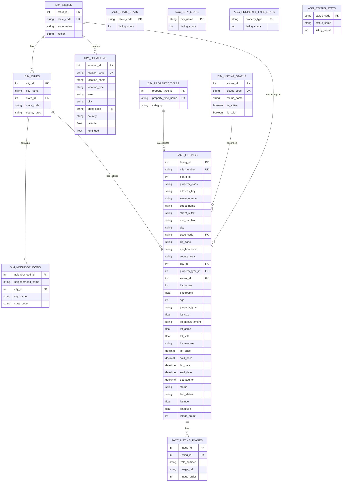

# Repliers Real Estate Data Model - ERD

## Entity Relationship Diagram



## Table Descriptions

### Dimension Tables

| Table | Description | Row Count |
|-------|-------------|-----------|
| `dim_states` | US States reference with regions | ~17 |
| `dim_cities` | Cities with state relationships | ~800+ |
| `dim_neighborhoods` | Neighborhoods within cities | ~2000+ |
| `dim_locations` | Geographic areas (counties, areas) | ~300 |
| `dim_property_types` | Property type classifications | ~10 |
| `dim_listing_status` | Listing status codes | ~12 |

### Fact Tables

| Table | Description | Row Count |
|-------|-------------|-----------|
| `fact_listings` | Main property listings (denormalized) | ~19,000+ |
| `fact_listing_images` | Property images (one row per image) | ~400,000+ |

### Aggregate Tables

| Table | Description |
|-------|-------------|
| `agg_state_stats` | Listings count by state |
| `agg_city_stats` | Listings count by city |
| `agg_property_type_stats` | Listings count by property type |
| `agg_status_stats` | Listings count by status |

## Key Relationships

1. **State → City → Neighborhood**: Geographic hierarchy
2. **Listing → Property Type**: What type of property
3. **Listing → Status**: Current listing status
4. **Listing → Images**: One-to-many relationship (avg 20 images per listing)

## Sample Queries

### Top 10 Cities by Listing Count
```sql
SELECT c.city_name, c.state_code, COUNT(*) as listings
FROM fact_listings l
JOIN dim_cities c ON l.city_id = c.city_id
GROUP BY c.city_name, c.state_code
ORDER BY listings DESC
LIMIT 10;
```

### Average Price by State
```sql
SELECT s.state_name, s.region,
       AVG(l.list_price) as avg_price,
       COUNT(*) as listings
FROM fact_listings l
JOIN dim_states s ON l.state_code = s.state_code
WHERE l.list_price > 0
GROUP BY s.state_name, s.region
ORDER BY avg_price DESC;
```

### Property Distribution by Type
```sql
SELECT pt.property_type_name, pt.category,
       COUNT(*) as listings,
       AVG(l.list_price) as avg_price
FROM fact_listings l
JOIN dim_property_types pt ON l.property_type_id = pt.property_type_id
GROUP BY pt.property_type_name, pt.category
ORDER BY listings DESC;
```
